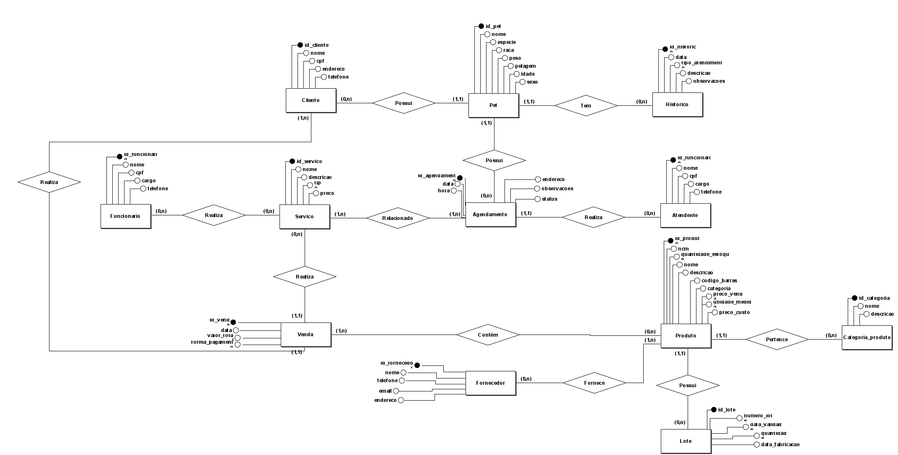

# Nome dos integrantes:

* **Isabelly Pereira de França - **RGM:** 48163732**
* **Giovanna Aparecida dos Santos - **RGM:** 47817518**
* **Carla Daiane Mamani Choque - **RGM:** 48011762**
* **Isabela Barbosa Pereira - **RGM:** 48693821**
* **Alan Carlos Teixeira Marinho de Araujo - **RGM:** 48693871**

# Modelagem de Banco de Dados para Mercadão Pet

## Introdução

O presente projeto tem como objetivo realizar a modelagem conceitual de um banco de dados para o Mercadão Pet, organização que atua na venda de produtos para animais, serviços de banho e tosa e atendimento relacionado à clínica veterinária.

A partir de uma pesquisa de campo realizada na organização, foram levantadas informações sobre seus principais processos, incluindo cadastro de clientes e pets, agendamentos, atendimentos, vendas, cadastro de produtos e controle de estoque.

Durante o levantamento, foi identificado como principal problema operacional a utilização de dois sistemas separados para o gerenciamento das vendas e do estoque. Como esses sistemas não são integrados, as informações relacionadas às vendas e à movimentação dos produtos não são atualizadas de forma conjunta, dificultando o acompanhamento da quantidade de itens disponíveis e tornando o controle de estoque menos eficiente.

Dessa forma, o projeto busca propor uma estrutura conceitual de banco de dados capaz de organizar e integrar as principais informações utilizadas pelo estabelecimento. A modelagem será delimitada aos processos relacionados a clientes, pets, funcionários, serviços, atendimentos, produtos, vendas e controle de estoque.

## Desenvolvimento

### Caracterização da Organização

**Nome e natureza da organização:**  
O grupo escolheu o Mercadão Pet, um estabelecimento do setor pet que atua com a venda de produtos para animais, serviços de banho e tosa e atendimento relacionado à clínica veterinária.

**Contexto e porte:**  
A organização possui diferentes áreas de atuação, envolvendo a comercialização de produtos e a prestação de serviços para animais. Entre as atividades realizadas, destaca-se o serviço de banho e tosa, que apresenta um volume aproximado de 400 atendimentos por semana. A organização conta com 20 funcionários envolvidos em suas atividades.

**Problemas e necessidades identificados:**  
Durante a pesquisa de campo, foi identificado que a organização utiliza dois sistemas separados para gerenciar as vendas e o estoque. Como esses sistemas não são integrados, as informações relacionadas às vendas e à movimentação do estoque não são atualizadas de forma conjunta.

Essa falta de integração pode dificultar o acompanhamento da quantidade de produtos disponíveis, exigindo maior controle por parte dos funcionários e tornando o gerenciamento do estoque menos eficiente.

Também foi observado que o cadastro de produtos é realizado manualmente, sendo registradas informações como preço de custo, NCM e código de barras. Diante disso, uma das principais necessidades identificadas é a integração entre as informações de vendas e estoque, permitindo um controle mais organizado e eficiente dos produtos e de suas movimentações.

**Justificativa da escolha:**  
O Mercadão Pet foi escolhido por apresentar uma variedade de processos de negócio e um volume significativo de informações relacionadas a clientes, pets, funcionários, serviços, atendimentos, produtos, vendas e estoque.

A diversidade de atividades realizadas pela organização torna o estabelecimento um caso adequado para o desenvolvimento de uma modelagem conceitual abrangente, permitindo representar diferentes processos e seus relacionamentos em uma estrutura integrada de banco de dados.

**Evidências da organização:**  

A existência da organização e o acesso para a realização da pesquisa de campo podem ser comprovados por meio das informações abaixo:

- **Endereço:** [Google Maps](https://maps.app.goo.gl/yea361WY7wQY4v9aA)
- **Telefone:** (11) 93015-6713
- **Responsável entrevistado:** Guilherme (Gerente)
- **Imagens:** 

  
  
  
  

### Requisitos Funcionais (RF)
- **RF01 (Gestão de Clientes e Pets):** 
Permite cadastrar, atualizar e consultar os dados dos clientes e seus respectivos pets vinculados.

- **RF02 (Histórico e Prontuário):**
Registra o histórico clínico, atendimentos e observações médicas vinculados ao pet.

- **RF03 (Agendamento de Serviços):**
Permite realizar o agendamento de banho, tosa e outros procedimentos, atrelado ao pet, o atendente e o serviço.

- **RF04 (Gestão de Vendas no Balcão):**
Permite emitir vendas no caixa unificado, associando os produtos do petshop e/ou os serviços prestados diretamente à venda.

- **RF05 (Baixa Automática por Lote - Solução do Problema Identificado):**
Realiza a baixa automática da `quantidade_atual` do lote correspondente no estoque a cada produto comercializado em uma venda.

- **RF06 (Gestão de Catálogo e Produtos):**
Permite registrar e atualizar produtos contendo código de barras, NCM, preço de custo, preço de venda e sua respectiva categoria.

- **RF07 (Gestão de Lotes e Validades):**
Permite cadastrar e consultar os lotes das mercadorias, controlando a quantidade física, número do lote, data de fabricação e data de validade de cada remessa.

- **RF08 (Cadastro de Fornecedores):**
Permite cadastrar e consultar fornecedores, associando-os aos produtos fornecidos ao estabelecimento.

---

### Requisitos Não Funcionais (RNF)

- **RNF01 (Integridade de Dados/Estoque por Lote):**
O sistema deve processar a baixa no lote correspondente em tempo real após a gravação de cada venda para evitar divergências e impedir a venda de itens esgotados.

- **RNF02 (Segurança e Privacidade/LGPD):**
O sistema deve restringir o acesso ao histórico médico dos pets e dados cadastrais dos clientes apenas a usuários autenticados e autorizados.

- **RNF03 (Disponibilidade):**
O módulo comercial (Caixa) e o módulo de agendamentos devem manter disponibilidade de operação durante todo o horário comercial do estabelecimento.

- **RNF04 (Usabilidade):** 
A interface do caixa e de agendamento deve ser simples e intuitiva para permitir finalizações rápidas de atendimentos no balcão.

---

### Regras de Negócio (RN)

- **RN01 (Venda/Lote):**
Uma venda de produto só pode ser finalizada no caixa se houver saldo suficiente na `quantidade_atual` do Lote selecionado do produto

- **RN02 (Obrigatoriedade do Tutor):** 
Todo Pet cadastrado no sistema deve possuir obrigatoriamente exatamente um Cliente associado `(1,1)`.

- **RN03 (Padrão Fiscal do Cadastro):**
Todo produto cadastrado deve conter obrigatoriamente um código NCM válido de 8 dígitos e preço de venda cadastrado

- **RN04 (Rastreabilidade por Lote):**
Todo lote registrado deve estar atrelado obrigatoriamente a exatamente um único produto cadastrado `(1,1)`. Um mesmo produto, contudo, pode possuir zero ou múltiplos lotes associados `(0,n)`.

- **RN05 (Controle de Validade):**
Não é permitida a venda ou saída no caixa de produtos pertencentes a um lote com data de validade vencida.

- **RN06 (Responsabilidade nos Agendamentos):**
Todo Agendamento cadastrado deve registrar obrigatoriamente o Atendente responsável pela marcação para fins de auditabilidade `(1,1)`.

- **RN07 (Histórico Inviolável):**
O histórico clínico de um pet não pode ser alterado ou apagado após a emissão do atendimento médico, garantindo a rastreabilidade veterinária.

- **RN08 (Capacidade Operacional de Banho e Tosa):**
A quantidade de agendamentos para um mesmo horário não pode ultrapassar o número de funcionários operacionais disponíveis no expediente.

## Modelagem Conceitual e Justificativa Técnica (DER)

### Entidades Reconhecidas
No Diagrama Entidade-Relacionamento (DER) ajustado para o Mercadão Pet, foram modeladas 12 entidades principais.

- **Cliente:** Tutor responsável pelo cadastro e pelos pets.
- **Pet:** Animal de estimação atendido na clínica ou no banho e tosa.
- **Historico:** Prontuário de atendimentos e histórico clínico do pet.
- **Agendamento:** Registro de horário e data para prestação de serviços.
- **Atendente:** Funcionário responsável pela recepção e marcação de agendamentos.
- **Funcionario:** Colaborador operacional que executa os serviços prestados.
- **Servico:** Catálogo de serviços oferecidos pelo estabelecimento (ex: Banho, Tosa, Consulta).
- **Venda:** Registro comercial e financeiro da transação no caixa.
- **Produto:** Cadastro dos itens comercializados na loja ou utilizados nos serviços.
- **Categoria_Produto:** Classificação catalográfica dos produtos da loja.
- **Lote:** Controle físico de estoque por remessas, registradas com data de validade, fabricação, custo e saldo físico.
- **Fornecedor:** Cadastro dos distribuidores e parceiros comerciais.

---

### Justificativa Técnica das Cardinalidades e Decisões de Modelagem

A definição de cardinalidades no modelo conceitual reflete diretamente as regras de negócio capturadas durante a pesquisa de campo no Mercadão Pet, garantindo a integridade dos dados e resolvendo os gargalos operacionais identificados.

#### Decisões Estratégicas para Resolução dos Problemas Identificados

* **Eliminação da Entidade Associativa no Modelo Conceitual:** Em conformidade com as diretrizes do Modelo Conceitual (DER) de nivelamento acadêmico, a entidade associativa/intermediária `Item_Venda` foi removida nesta etapa. A relação comercial entre vendas e mercadorias é expressa diretamente pelo relacionamento de muitos-para-muitos `(1,n) Contém (1,n)` entre as entidades **Venda** e **Produto**.

* **Gestão de Validade e Rastreabilidade por Lote (Solução da Crise do Estoque):** Para resolver o problema do estoque separado/defasado e atender à exigência de rastreabilidade de mercadorias perecíveis (como rações e medicamentos), a entidade `Estoque` foi convertida em **Lote**. Cada produto pode ter zero ou vários lotes ativos no sistema `Produto (1,1) --- Possui --- (0,n) Lote`, permitindo o acompanhamento individualizado de datas de fabricação, expiração de validade e saldos por remessa.

* **Integração dos Serviços ao Caixa:** Os agendamentos de banho e tosa relacionam-se com a entidade `Servico` `(1,n) Relacionado (1,n)`, permitindo que atendimentos prestados gerem seus respectivos lançamentos em `Venda`, unificando o faturamento do balcão.

* **Rastreabilidade e Atendimento Médico:** A entidade `Pet` mantém cardinalidade `(1,1) Tem (0,n)` com a entidade `Historico`, garantindo que todas as consultas e observações fiquem atreladas a um único animal ao longo do tempo.

* **Fornecedores no Sistema:** Adicionou-se a entidade `Fornecedor` com relação `(0,n) Fornece (1,1) Produto` para suprir a falta de cadastro sistêmico de fornecedores identificada na entrevista.

#### Defesa Integral de Todas as Cardinalidades do DER

**Cliente (0,n) — Possui — (1,1) Pet**
Um cliente pode se cadastrar no sistema antes de ter um pet ativo ou registrar múltiplos animais (`0,n`). Por outro lado, para fins de responsabilidade financeira e legal no estabelecimento, cada pet cadastrado deve obrigatoriamente estar vinculado a exatamente um tutor responsável (`1,1`).

**Pet (1,1) — Tem — (0,n) Historico**
Um pet recém-cadastrado pode ainda não ter nenhum registro clínico (`0,n`), acumulando prontuários conforme realiza atendimentos. Cada registro de histórico, porém, pertence exclusivamente a um único pet (`1,1`), impedindo que prontuários sejam misturados entre animais.

**Pet (1,1) — Possui — (0,n) Agendamento**
Um pet pode ter zero ou vários agendamentos ao longo do tempo (`0,n`), mas cada agendamento é emitido exclusivamente para um único animal (`1,1`).

**Agendamento (1,1) — Realiza — (0,n) Atendente**
Um atendente de recepção pode registrar múltiplos agendamentos ao longo do expediente (`0,n`). Para garantir o controle sobre quem marcou o horário, cada agendamento registra obrigatoriamente exatamente um atendente responsável (`1,1`).

**Agendamento (1,n) — Relacionado — (1,n) Servico**
Um agendamento pode conter um ou mais serviços contratados simultaneamente (ex.: Banho + Tosa) (`1,n`), e um tipo de serviço do catálogo pode estar associado a múltiplos agendamentos no sistema (`1,n`).

**Funcionario (0,n) — Realiza — (0,n) Servico / Venda**
Um funcionário da parte operacional realiza diversos serviços de banho/tosa ou vendas ao longo do dia (`0,n`), garantindo a prestação de serviços por colaboradores devidamente cadastrados.

**Cliente (1,n) — Realiza — (1,1) Venda**
Um cliente cadastrado pode realizar diversas compras e pagamentos no balcão ao longo do tempo (`1,n`), enquanto cada cupom de venda emitido é atribuído obrigatoriamente a um cliente específico (`1,1`).

**Venda (1,n) — Contém — (1,n) Produto**
Uma venda deve conter obrigatoriamente pelo menos um produto ou serviço comercializado (`1,n`). Da mesma forma, um produto cadastrado no catálogo pode constar em diversas vendas emitidas ao longo do tempo (`1,n`).

**Produto (1,1) — Pertence — (0,n) Categoria_Produto**
Todo produto cadastrado deve ter uma categoria associada (`1,1`) para organização da loja (ex.: Rações, Brinquedos, Medicamentos). Uma categoria, por sua vez, pode agrupar diversos produtos (`0,n`).

**Produto (1,1) — Possui — (0,n) Lote**
Cada lote registrado no sistema pertence unicamente a exatamente um produto (`1,1`). Um produto cadastrado no catálogo, por outro lado, pode não possuir lotes em estoque no momento do cadastro ou possuir múltiplos lotes simultâneos oriundos de diferentes remessas de recebimento (`0,n`).

**Fornecedor (0,n) — Fornece — (1,1) Produto**
Um fornecedor cadastrado pode abastecer a loja com diversos produtos (`0,n`), e cada produto possui a indicação de seu fornecedor principal (`1,1`).

---

### Diagrama Entidade-Relacionamento (DER)

### Uso de Inteligência Artificial

|**Item**|**O que registrar**|
|-|-|
|**Ferramenta e etapa**|Gemini. Utilizado na etapa de validação conceitual e revisão técnica do Diagrama Entidade-Relacionamento (DER)|
|**Motivação**|Analisar o primeiro rascunho do nosso projeto para encontrar erros de lógica, verificar se as cardinalidades estavam certas e ver se faltava alguma informação importante antes de desenhar a versão final no sistema.|
|**Prompt(s) utilizados**|"Analise os dados da entrevista com a clínica/petshop em conjunto com o esqueleto da Entrega 1. Verifique as falhas do meu primeiro esboço (DER) e informe o que pode ser melhorado para atender aos requisitos da modelagem conceitual."|
|**Resposta recebida**|A IA apontou a inconsistência de ligar Venda diretamente a Categoria\_Produto, sugeriu criar a entidade associativa Item\_Venda, recomendou detalhar o controle de estoque de produtos a granel e alertou sobre a redundância de ter uma entidade separada para Histórico.|
|**Fontes consultadas e verificadas**|Comparação direta entre os feedbacks da IA e a transcrição da entrevista realizada na clínica/petshop, além da checagem com o material didático da disciplina sobre Regras de Negócio e Notação Conceitual de DER.|
|**Trechos rejeitados ou corrigidos**|**Rejeitado:** A sugestão inicial da IA de eliminar totalmente a entidade Histórico e Adicionar a entidade Item_Venda e Estoque. O grupo optou por mantê-la a emtidade Histórico como uma entidade específica vinculada ao Pet para registrar observações médicas e clínicas passadas de forma isolada do fluxo operacional diário de agendamentos. O grupo também optou por remover a entidade Item_Venda, pois não se encaixa no modelo conceitual e, transformar a entidade Estoque em Lote.   **Corrigido:** Manter a entidade Histórico como entidade específica vinculada ao Pet. Remover a entidade Item_Venda, pois não se encaixa no modelo conceitual e, transformar a entidade Estoque em Lote.|
|**Justificativa da escolha final**|Todas as entidades, atributos e relacionamentos foram desenhados manualmente pelo grupo no software brModelo. A IA serviu estritamente para apontar gaps de lógica; a tomada de decisão final levou em consideração a real necessidade da empresa entrevistada.|
|**Reflexão crítica**|A IA às vezes dá soluções muito genéricas ou simples demais, que não mostram como as coisas funcionam na prática no dia a dia da clínica e do petshop (como o controle de estoque e as fichas de atendimento). Por isso, o nosso olhar foi essencial para pegar a teoria do banco de dados e ajustar do jeito que a empresa realmente precisa.|
|-|-|
| **Ferramenta e etapa** | ChatGPT. Utilizado na etapa de revisão textual e formatação do README.md do projeto. |
| **Motivação** | Revisar a ortografia e a gramática do texto elaborado pelo grupo, além de auxiliar na organização das informações de acordo com a estrutura solicitada para o README.md no GitHub. |
| **Prompt(s) utilizados** | "Revise a ortografia e a gramática deste texto sem alterar sua essência. Organize o conteúdo considerando que ele será utilizado no README.md de um projeto de modelagem de banco de dados."    "Leve em conta este exemplo de estrutura solicitado pelo professor e ajuste o nosso texto para atender aos requisitos de Introdução, Desenvolvimento, Caracterização da Organização, Problemas e Necessidades, Justificativa da Escolha e Evidências da Organização." |
| **Resposta recebida** | O ChatGPT realizou correções de ortografia, gramática e pontuação, além de sugerir ajustes na organização e na estrutura do texto para adequá-lo ao formato Markdown utilizado no GitHub. Também foram sugeridas melhorias na descrição dos problemas operacionais, dos objetivos e da delimitação do projeto. |
| **Fontes consultadas e verificadas** | Texto original elaborado pelo grupo, orientações fornecidas pelo professor para a estrutura do README.md e informações obtidas durante a pesquisa de campo realizada no Mercadão Pet. |
| **Trechos rejeitados ou corrigidos** | **Corrigido:** Erros de ortografia, pontuação e concordância presentes no texto original. Alguns trechos foram reorganizados para deixar mais explícitos o problema operacional identificado, os objetivos do projeto e a delimitação da modelagem.    **Rejeitado:** Sugestões que alteravam a essência das informações obtidas durante a pesquisa de campo. O grupo manteve as informações originais e utilizou a IA apenas como apoio na revisão e organização do texto. |
| **Justificativa da escolha final** | O conteúdo e as informações apresentadas no README.md foram definidos pelo grupo com base na pesquisa de campo e nas orientações da disciplina. O ChatGPT foi utilizado somente como ferramenta de apoio para revisão textual, correção ortográfica e organização do conteúdo no formato Markdown. |
| **Reflexão crítica** | A utilização da IA facilitou a identificação de erros de escrita e ajudou a organizar o conteúdo de maneira mais clara e adequada ao formato do GitHub. Entretanto, a ferramenta não foi utilizada para definir as informações do projeto ou tomar decisões sobre a modelagem do banco de dados. A revisão final foi realizada pelo grupo, que verificou se as alterações mantinham o conteúdo e as informações obtidas durante a pesquisa. |
|-|-|
| **Ferramenta e etapa** | Gemini. Utilizado na etapa de elicitação, refinamento e validação dos Requisitos Funcionais (RF), Requisitos Não Funcionais (RNF) e Regras de Negócio (RN) para o sistema da clínica e petshop. |
| **Motivação** | Garantir que a especificação do sistema estivesse completa, sem ambiguidades, cobrindo tanto as necessidades operacionais cotidianas (como vendas e agendamentos) quanto as restrições técnicas (segurança, LGPD e integridade de dados). |
| **Prompt(s) utilizados** | "A partir da transcrição da entrevista com a clínica/petshop e do nosso DER modelado, ajude a estruturar de forma clara os Requisitos Funcionais, Não Funcionais e Regras de Negócio do sistema, garantindo alinhamento com a substituição do estoque unificado pela entidade Lote e a remoção da entidade associativa Item_Venda no modelo conceitual." |
| **Resposta recebida** |A IA estruturou listas separadas para RFs, RNFs e RNs, sugerindo a baixa automática da quantidade_atual do Lote em tempo real na venda, inclusão de regras para controle de validade e NCM, restrições de LGPD no prontuário médico e validação de saldos no caixa antes da finalização |
| **Fontes consultadas e verificadas** | Validação cruzada com o Diagrama Entidade-Relacionamento (DER) do grupo, as regras de negócio obtidas na entrevista com a empresa e o material didático sobre Engenharia de Requisitos. |
| **Trechos rejeitados ou corrigidos** | Rejeitado:A sugestão inicial da IA de criar um requisito complexo de controle de comissão para atendentes. Como isso não era foco do escopo atual da clínica, o grupo optou por focar apenas na auditabilidade dos agendamentos (RN06)    Corrigido: Ajuste no RF05, RNF01 e RN01 para refletir a remoção da entidade Item_Venda no DER conceitual e especificar que a baixa de estoque ocorre em tempo real diretamente na entidade Lote, prevenindo a venda de itens vencidos ou esgotados |
| **Justificativa da escolha final** | Os requisitos e regras finais foram selecionados e adaptados para refletirem fielmente as prioridades do petshop, garantindo que o sistema atenda tanto a parte fiscal e o controle de validade por lote quanto a agilidade no atendimento de balcão e clínico |
| **Reflexão crítica** | A IA ajuda a organizar e padronizar o formato dos requisitos e tabelas de software. No entanto, a definição exata de quais restrições são vitais para o negócio, como o rastreamento individual de validades de medicamentos via Lote ou a capacidade operacional de banho e tosa, exigiu a percepção crítica e a tomada de decisão do grupo frente à realidade da empresa. |
