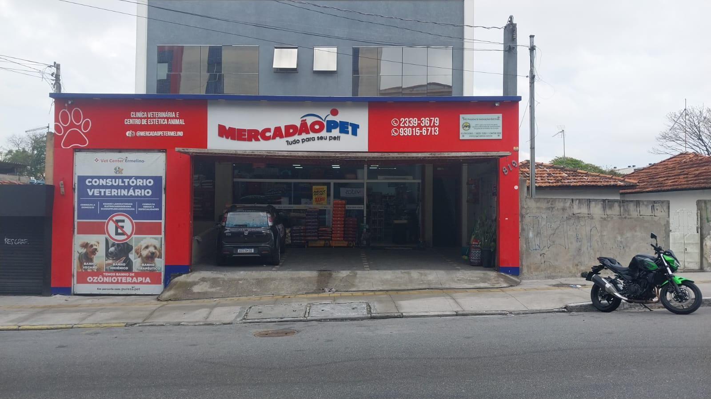
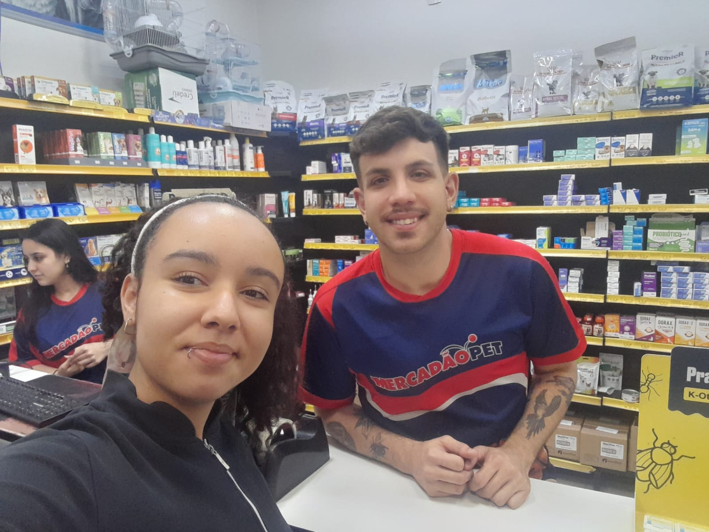
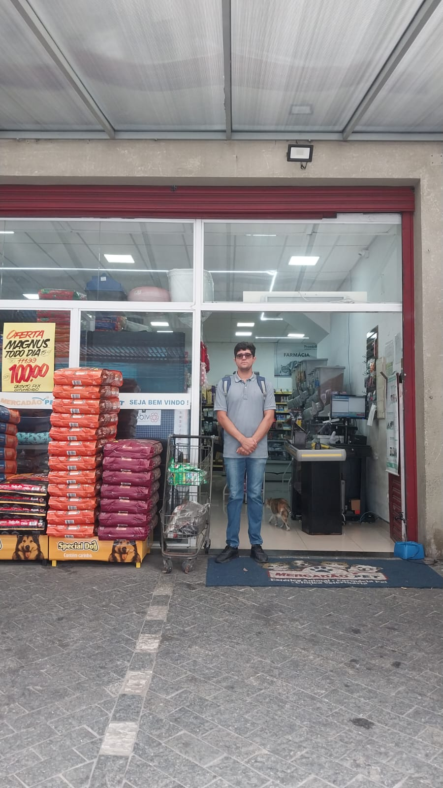
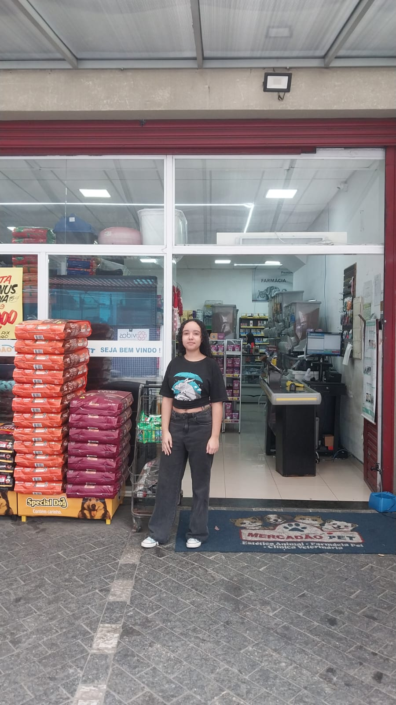
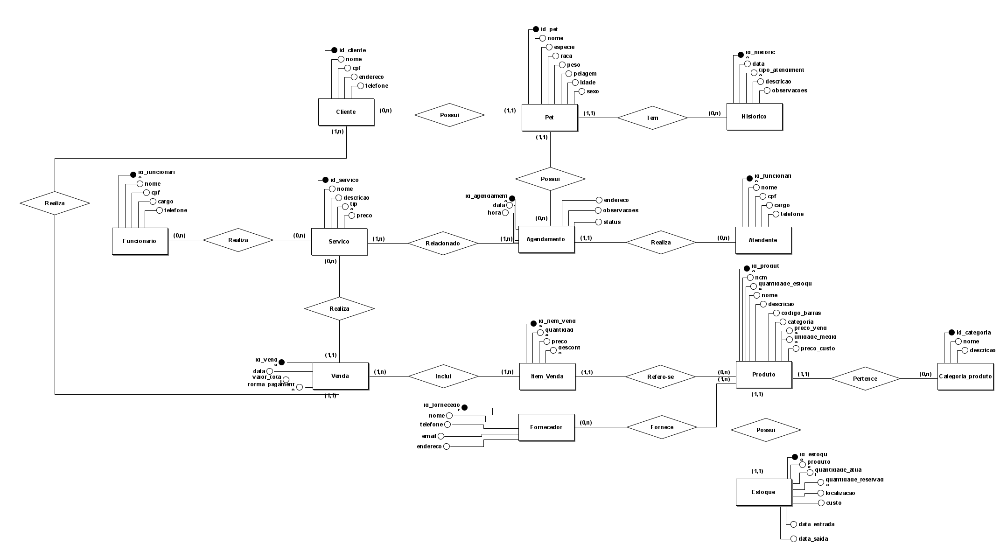

# Modelagem de Banco de Dados para Mercadão Pet

## Introdução

O presente projeto tem como objetivo realizar a modelagem conceitual de um banco de dados para o Mercadão Pet, organização que atua na venda de produtos para animais, serviços de banho e tosa e atendimento relacionado à clínica veterinária.

A partir de uma pesquisa de campo realizada na organização, foram levantadas informações sobre seus principais processos, incluindo cadastro de clientes e pets, agendamentos, atendimentos, vendas, cadastro de produtos e controle de estoque.

Durante o levantamento, foi identificado como principal problema operacional a utilização de dois sistemas separados para o gerenciamento das vendas e do estoque. Como esses sistemas não são integrados, as informações relacionadas às vendas e à movimentação dos produtos não são atualizadas de forma conjunta, dificultando o acompanhamento da quantidade de itens disponíveis e tornando o controle de estoque menos eficiente.

Dessa forma, o projeto busca propor uma estrutura conceitual de banco de dados capaz de organizar e integrar as principais informações utilizadas pelo estabelecimento. A modelagem será delimitada aos processos relacionados a clientes, pets, funcionários, serviços, atendimentos, produtos, vendas e controle de estoque.

## Desenvolvimento

### Caracterização da Organização

**Nome e natureza da organização:**  
O grupo escolheu o Mercadão Pet, um estabelecimento do setor pet que atua com a venda de produtos para animais, serviços de banho e tosa e atendimento relacionado à clínica veterinária.

**Contexto e porte:**  
A organização possui diferentes áreas de atuação, envolvendo a comercialização de produtos e a prestação de serviços para animais. Entre as atividades realizadas, destaca-se o serviço de banho e tosa, que apresenta um volume aproximado de 400 atendimentos por semana. A organização conta com 20 funcionários envolvidos em suas atividades.

**Problemas e necessidades identificados:**  
Durante a pesquisa de campo, foi identificado que a organização utiliza dois sistemas separados para gerenciar as vendas e o estoque. Como esses sistemas não são integrados, as informações relacionadas às vendas e à movimentação do estoque não são atualizadas de forma conjunta.

Essa falta de integração pode dificultar o acompanhamento da quantidade de produtos disponíveis, exigindo maior controle por parte dos funcionários e tornando o gerenciamento do estoque menos eficiente.

Também foi observado que o cadastro de produtos é realizado manualmente, sendo registradas informações como preço de custo, NCM e código de barras. Diante disso, uma das principais necessidades identificadas é a integração entre as informações de vendas e estoque, permitindo um controle mais organizado e eficiente dos produtos e de suas movimentações.

**Justificativa da escolha:**  
O Mercadão Pet foi escolhido por apresentar uma variedade de processos de negócio e um volume significativo de informações relacionadas a clientes, pets, funcionários, serviços, atendimentos, produtos, vendas e estoque.

A diversidade de atividades realizadas pela organização torna o estabelecimento um caso adequado para o desenvolvimento de uma modelagem conceitual abrangente, permitindo representar diferentes processos e seus relacionamentos em uma estrutura integrada de banco de dados.

**Evidências da organização:**  

A existência da organização e o acesso para a realização da pesquisa de campo podem ser comprovados por meio das informações abaixo:

- **Endereço:** [Google Maps](https://maps.app.goo.gl/yea361WY7wQY4v9aA)
- **Telefone:** (11) 93015-6713
- **Responsável entrevistado:** Guilherme (Gerente)
- **Imagens:** 

  
  
  
  

## Modelagem Conceitual e Justificativa Técnica (DER)

## Entidades, Atributos e Relacionamentos
Com base no levantamento realizado no Mercadão Pet, foram modeladas 13 entidades principais para cobrir a venda de produtos, serviços de banho/tosa e atendimento veterinário.

- **Cliente:** Tutor do animal (`id_cliente`, `nome`, `cpf`, `endereco`, `telefone`).
- **Pet:** Animal de estimação (`id_pet`, `nome`, `especie`, `raca`, `peso`, `pelagem`, `idade`, `sexo`).
- **Histórico:** Pontuário clínico e médico do pet (`id_historico`, `data`, `tipo_atendimento`, `descricao`, `observacoes`).
- **Agendamento:** Marcação de banho, tosa e procedimentos (`id_agendamento`, `data`, `hora`, `endereco`, `observacoes`, `status`).
- **Atendente:** Funcionário responsável pelos agendamentos e recepção (`id_funcionario`, `nome`, `cpf`, `cargo`, `telefone`).
- **Funcionário:** Colaborador que executa os serviços operacionais (`id_funcionario`, `nome`, `cpf`, `cargo`, `telefone`).
- **Serviço:** Catálogo de serviços prestados (`id_servico`, `nome`, `descricao`, `tipo`, `preco`).
- **Venda:** Registro financeiro da compra ou atendimento (`id_venda`, `data`, `valor_total`, `forma_pagamento`).
- **Item_Venda:** Entidade que associa produtos e serviços às vendas (`id_item_venda`, `quantidade`, `preco`, `desconto`).
- **Produto:** Catálogo de produtos vendidos no petshop (`id_produto`, `ncm`, `codigo_barras`, `nome`, `descricao`, `preco_custo`, `preco_venda`, `unidade_medida`).
- **Categoria_Produto:** Classificação dos itens da loja (`id_categoria`, `nome`, `descricao`).
- **Estoque:** Controle em tempo real do volume físico (`id_estoque`, `quantidade_atual`, `quantidade_reservada`, `localizacao`, `custo`, `data_entrada`, `data_saida`).
- **Fornecedor:** Cadastro de parceiros e distribuidores (`id_fornecedor`, `nome`, `telefone`, `email`, `endereco`).

## Justificativa Técnica das Cardinalidades e Decisões de Modelagem

**Decisões Estratégicas para Resolução dos Problemas Identificados**

- **Solução da crise do estoque defasado:** Na pesquisa realizada de campo, constatou-se a utilização de dois sistemas não integrados (sistema Moura + sistema de estoque seperado). Para resolver esse problema, estabeleceu-se o relacionamento de 1 para 1 (`1,1`) possui (`1,1`) entre **Produto** e **Estoque**. Dessa forma, cada item vendido na entidade `Item_Venda` causa o abatimento em tempo real da `quantidade_atual` do estoque unificado.

- **Integração dos Serviços ao Caixa:** Os agendamentos de banho e tosa relacionam-se com a entidade `Servico` (`1,n`) Relacionado (`1,n`), permitindo que atendimentos prestados gerem seus respectivos lançamentos em `Venda`, unificando o faturamento do balcão.

- **Rastreabilidade e Atendimento:** A entidade `Pet` mantém cardinalidade (`1,1`) tem (`0,n`) com a entidade `Historico`, garantindo que todas as consultas e observações fiquem atreladas a um único animal ao longo do tempo.

- **Fornecedores no Sistema:** Adicionou-se a entidade `Fornecedor` com relação (`0,n`) Fornece (`1,1`) `Produto` para suprir a falta de cadastro sistêmico de fornecedores identificada na entrevista.

**Todas as Cardinalidades do DER**

- **Cliente (0,n) — Possui — (1,1) Pet**
Um cliente pode se cadastrar no sistema antes de ter um pet ativo ou registrar múltiplos animais (`0,n`). Por outro lado, para fins de responsabilidade financeira e legal no estabelecimento, cada pet cadastrado deve obrigatoriamente estar vinculado a exatamente um tutor responsável (`1,1`).

- **Pet (1,1) — Tem — (0,n) Historico**
Um pet recém-cadastrado pode ainda não ter nenhum registro clínico (`0,n`), acumulando prontuários conforme realiza atendimentos. Cada registro de histórico, porém, pertence exclusivamente a um único pet (`1,1`), impedindo que prontuários sejam misturados entre animais.

- **Pet (1,1) — Possui — (0,n) Agendamento**
Um pet pode ter zero ou vários agendamentos ao longo do tempo (`0,n`), mas cada agendamento é emitido exclusivamente para um único animal (`1,1`).

- **Agendamento (1,1) — Realiza — (0,n) Atendente**
Um atendente de recepção pode registrar múltiplos agendamentos ao longo do expediente (`0,n`). Para garantir o controle sobre quem marcou o horário, cada agendamento registra obrigatoriamente exatamente um atendente responsável (`1,1`).

- **Agendamento (1,n) — Relacionado — (1,n) Servico**
Um agendamento pode conter um ou mais serviços contratados simultaneamente (ex.: Banho + Tosa) (`1,n`), e um tipo de serviço do catálogo pode estar associado a múltiplos agendamentos no sistema (`1,n`).

- **Funcionario (0,n) — Realiza — (0,n) Servico / Venda**
Um funcionário da parte operacional realiza diversos serviços de banho/tosa ou vendas ao longo do dia (`0,n`), garantindo a prestação de serviços por colaboradores devidamente cadastrados.

- **Cliente (1,n) — Realiza — (1,1) Venda**
Um cliente cadastrado pode realizar diversas compras e pagamentos no balcão ao longo do tempo (`1,n`), enquanto cada cupom de venda emitido é atribuído obrigatoriamente a um cliente específico (`1,1`).

- **Venda (1,n) — Inclui — (1,n) Item_Venda — (1,1) Refere-se — (0,n) Produto**
Uma venda necessita obrigatoriamente de pelo menos um item registrado (`1,n`). A entidade associativa `Item_Venda` desmembra a transação, associando cada item a exatamente um produto (`1,1`), enquanto um produto cadastrado no catálogo pode constar em múltiplos itens de vendas emitidas (`0,n`).

- **Produto (1,1) — Pertence — (0,n) Categoria_Produto**
Todo produto cadastrado deve ter uma categoria associada (`1,1`) para organização da loja (ex: Rações, Brinquedos, Medicamentos). Uma categoria, por sua vez, pode agrupar diversos produtos (`0,n`).

- **Produto (1,1) — Possui — (1,1) Estoque**
Relacionamento unívoco (`1:1`) que garante que a quantidade disponível no estoque físico seja vinculada em tempo real ao cadastro do produto, eliminando discrepâncias entre o caixa e o estoque.

### Uso de Inteligência Artificial

|**Item**|**O que registrar**|
|-|-|
|**Ferramenta e etapa**|Gemini. Utilizado na etapa de validação conceitual e revisão técnica do Diagrama Entidade-Relacionamento (DER)|
|**Motivação**|Analisar o primeiro rascunho do nosso projeto para encontrar erros de lógica, verificar se as cardinalidades estavam certas e ver se faltava alguma informação importante antes de desenhar a versão final no sistema.|
|**Prompt(s) utilizados**|"Analise os dados da entrevista com a clínica/petshop em conjunto com o esqueleto da Entrega 1. Verifique as falhas do meu primeiro esboço (DER) e informe o que pode ser melhorado para atender aos requisitos da modelagem conceitual."|
|**Resposta recebida**|A IA apontou a inconsistência de ligar Venda diretamente a Categoria\_Produto, sugeriu criar a entidade associativa Item\_Venda, recomendou detalhar o controle de estoque de produtos a granel e alertou sobre a redundância de ter uma entidade separada para Histórico.|
|**Fontes consultadas e verificadas**|Comparação direta entre os feedbacks da IA e a transcrição da entrevista realizada na clínica/petshop, além da checagem com o material didático da disciplina sobre Regras de Negócio e Notação Conceitual de DER.|
|**Trechos rejeitados ou corrigidos**|**Rejeitado:** A sugestão inicial da IA de eliminar totalmente a entidade Histórico. O grupo optou por mantê-la como uma entidade específica vinculada ao Pet para registrar observações médicas e clínicas passadas de forma isolada do fluxo operacional diário de agendamentos.   **Corrigido:** A sugestão de simplificar o estoque. O grupo preferiu modelar a entidade Estoque separadamente de Produto para garantir o controle exato de entradas, saídas e itens a granel.|
|**Justificativa da escolha final**|Todas as entidades, atributos e relacionamentos foram desenhados manualmente pelo grupo no software brModelo. A IA serviu estritamente para apontar gaps de lógica; a tomada de decisão final levou em consideração a real necessidade da empresa entrevistada.|
|**Reflexão crítica**|A IA às vezes dá soluções muito genéricas ou simples demais, que não mostram como as coisas funcionam na prática no dia a dia da clínica e do petshop (como o controle de estoque e as fichas de atendimento). Por isso, o nosso olhar foi essencial para pegar a teoria do banco de dados e ajustar do jeito que a empresa realmente precisa.|
